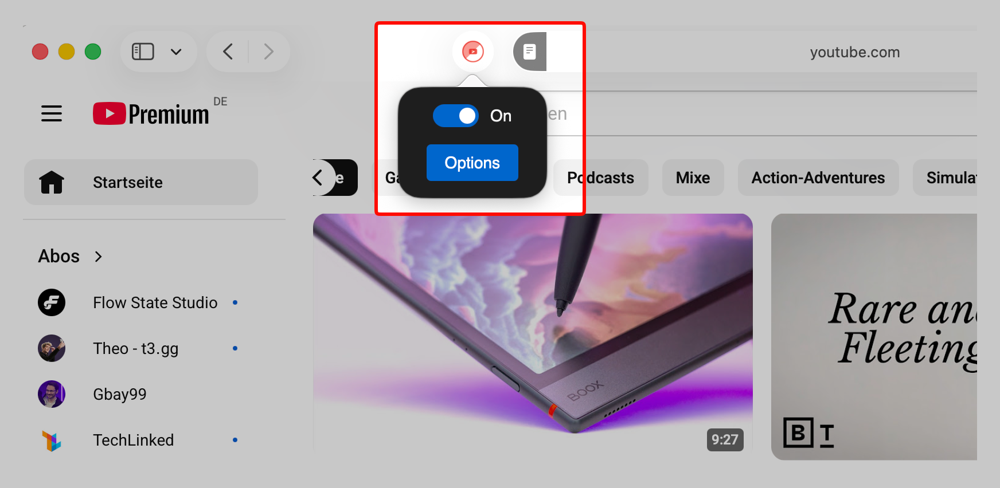
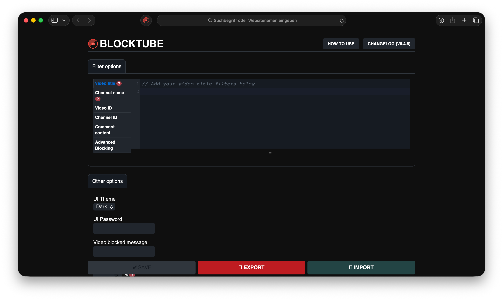
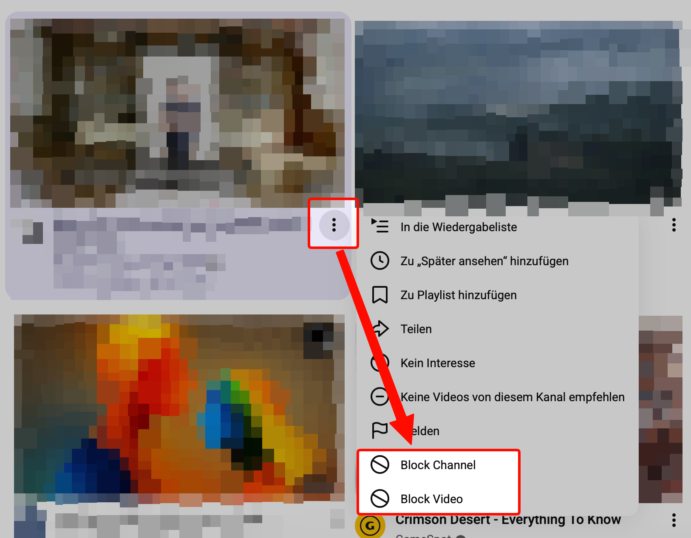
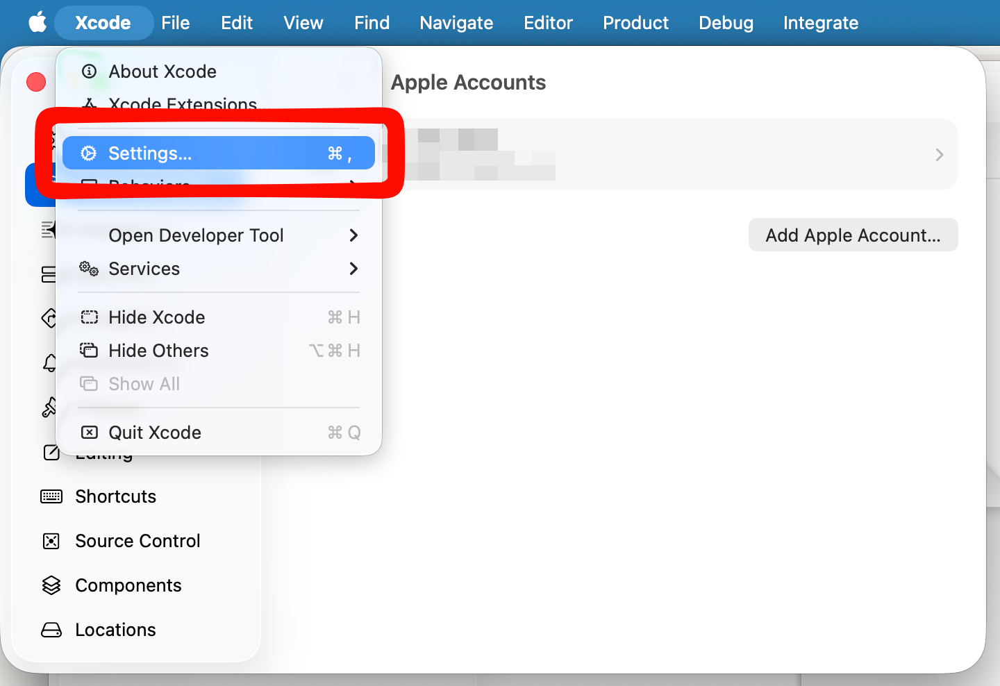
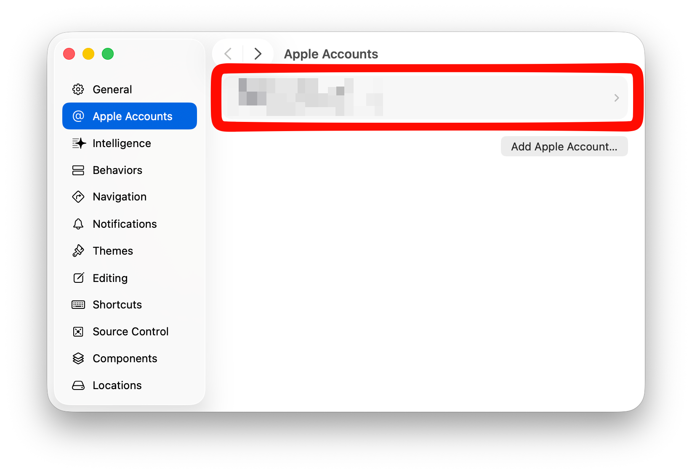
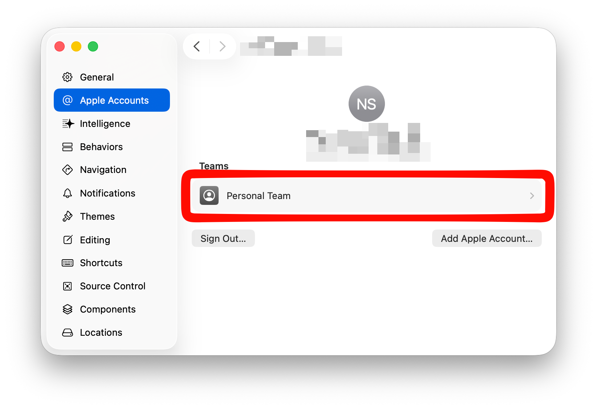
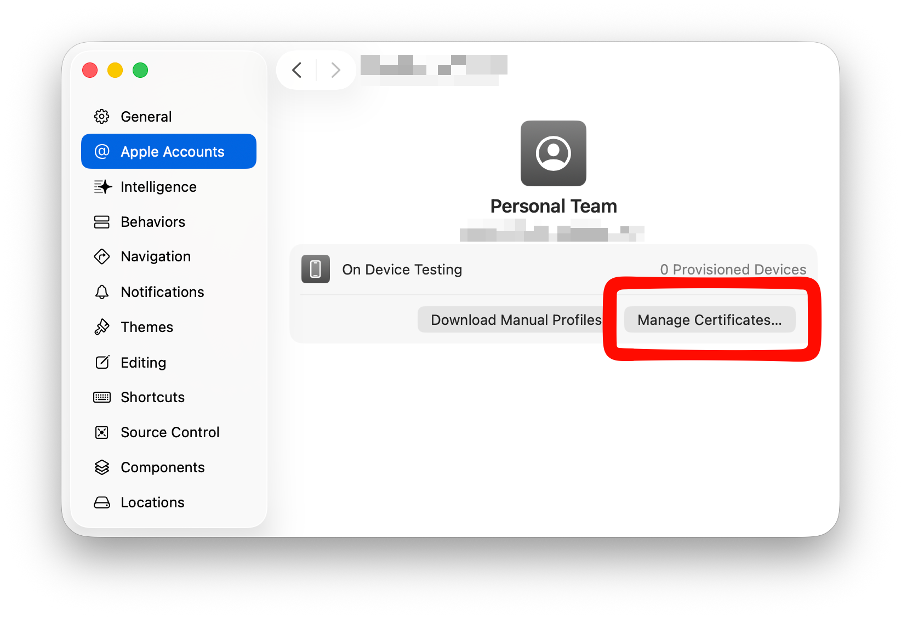
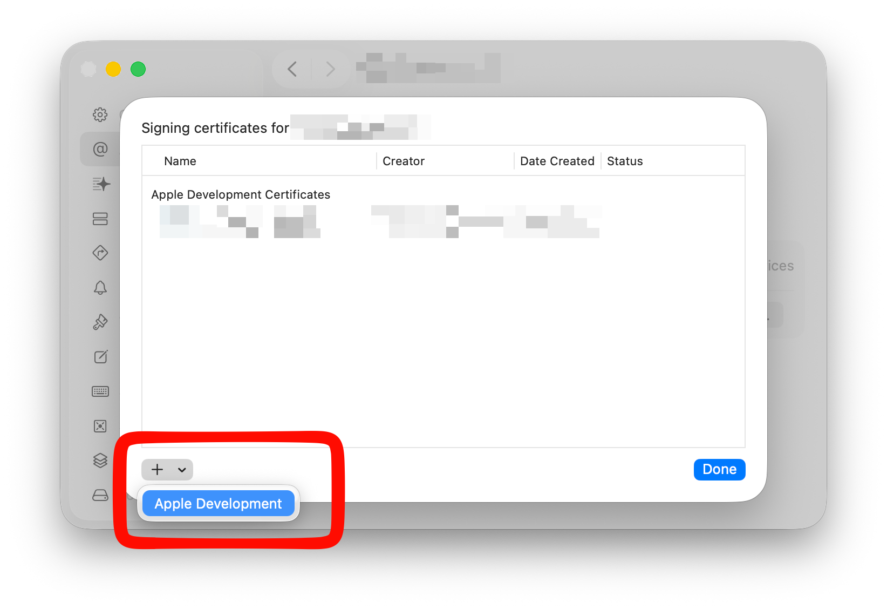

# BlockTube for Safari

A macOS Safari Web Extension that blocks YouTube videos, channels, and comments by title, channel name, channel ID, video ID, or keyword. This is a Safari port of the original [BlockTube](https://github.com/amitbl/blocktube) extension for Chrome and Firefox.

<div align="center">
  
  
  
</div>

<br>

**What it blocks:**
- Videos by title, channel name, channel ID, or video ID
- Comments by user or content
- Supports "Block Channel" and "Block Video" context actions directly on YouTube
- Filtering runs early enough that blocked content does not visibly render

**Filter syntax:**
- `keyword` — exact word match
- `news*` — matches anything starting with "news" (news, newsletter, etc.)
- `*news*` — matches anything containing "news"
- `/pattern/flags` — raw regular expression

## Build and run on macOS

### Prerequisites

- Full Xcode (not just Command Line Tools) — available free on the [Mac App Store](https://apps.apple.com/app/xcode/id497799835). Verify with `xcode-select -p` — it should point to `/Applications/Xcode.app`. If it doesn't, run:
  ```
  sudo xcode-select -s /Applications/Xcode.app/Contents/Developer
  ```
- An Apple ID added to Xcode (Xcode > Settings > Accounts). A free Apple ID is sufficient.

### First-time setup: signing

Required once. Without a signing team Safari will reset the "Allow Unsigned Extensions" flag on every restart.

1. Copy the signing config template:
   ```
   cp platform/safari/xcode/LocalConfig.xcconfig.example platform/safari/xcode/LocalConfig.xcconfig
   ```
2. Find your Team ID:
   ```
   security find-certificate -a -c "Apple Development" -p | openssl x509 -noout -subject
   ```
   The Team ID is the `OU` field (10-character alphanumeric string). If nothing is returned, you need to create an Apple Development certificate first:

   - Open **Xcode → Settings**

     

   - Go to **Apple Accounts** and select your Apple ID

     

   - Click your **Personal Team**

     

   - Click **Manage Certificates**

     

   - Click **+** and choose **Apple Development**

     

   Then run the `security` command above again to get your Team ID.

3. Edit `platform/safari/xcode/LocalConfig.xcconfig` and set your Team ID:
   ```
   DEVELOPMENT_TEAM = YOUR_TEAM_ID
   ```

`LocalConfig.xcconfig` is gitignored and will never be committed.

### Build and install

1. Build the Safari host app and extension:
   ```
   ./tools/build_safari.sh
   ```
2. Launch the built app once to register the extension with Safari:
   ```
   open "platform/safari/build/Build/Products/Debug/BlockTube for Safari.app"
   ```
3. Open `Safari > Settings > Extensions`, enable BlockTube for Safari, and allow access for `www.youtube.com` and `m.youtube.com`.

After the first launch you do not need to relaunch the host app after rebuilds — just run `./tools/build_safari.sh` again.

### Rebuilding after source changes

Edit files under `src/` and run `./tools/build_safari.sh`. The files under `platform/safari/xcode/BlockTube for Safari Extension/Resources/` are generated on each build and should not be edited directly.

## Debugging in Safari

Enable the Develop menu (Safari > Settings > Advanced > Show features for web developers), then use Web Inspector to inspect the background service worker, content scripts, popup, and options page on YouTube.

## References

- Original upstream project: <https://github.com/amitbl/blocktube>
- Apple Safari Web Extensions overview: <https://developer.apple.com/documentation/safariservices/safari-web-extensions>
- Packaging a web extension for Safari: <https://developer.apple.com/documentation/safariservices/packaging-a-web-extension-for-safari>

## Attribution

This project is a fork of [BlockTube](https://github.com/amitbl/blocktube) by [amitbl](https://github.com/amitbl). The core filtering engine, content scripts, popup, and options UI are derived from that original work. The Safari platform wrapper, Xcode project, cross-browser API shim (`ext_api.js`), and Safari-specific background handling are additions made in this fork.

## License

This project is based on BlockTube and remains under the GPLv3 license. See [LICENSE](LICENSE) for details.
